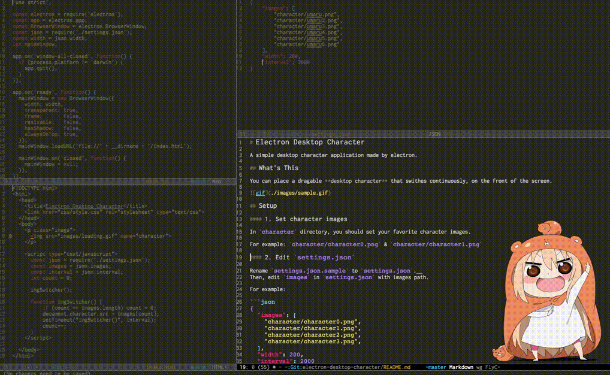

# Electron Desktop Character

A simple desktop character application made by electron.

## What's This

You can place a dragable **desktop character** that swithes continuously, on the front of the screen.



## Setup

#### 1. Set character images

In `character` directory, you should set your favorite character images. 

For example: `character/character0.png` & `character/character1.png`

#### 2. Edit `settings.json`

Rename `settings.json.sample` to `settings.json`.  
Then, edit `images` in `settings.json` with images path.

For example:

```json
{
  "images": [
    "character/character0.png",
    "character/character1.png",
    "character/character2.png",
    "character/character3.png",
  ],
  "width": 200,
  "interval": 2000
}
```

## Usage

Execute commands bellow.

```sh
$ cd electron-desktop-character
$ electron .
```

Then, you can see the sequential and dragable desktop character !

## Advanced Usage

In `settings.json`, you can edit some variables.

+ `width`: the width of the application window.
+ `interval`: the interval for switching images.
